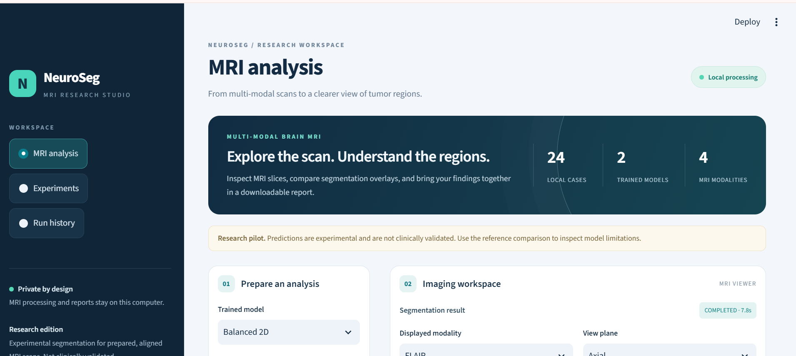
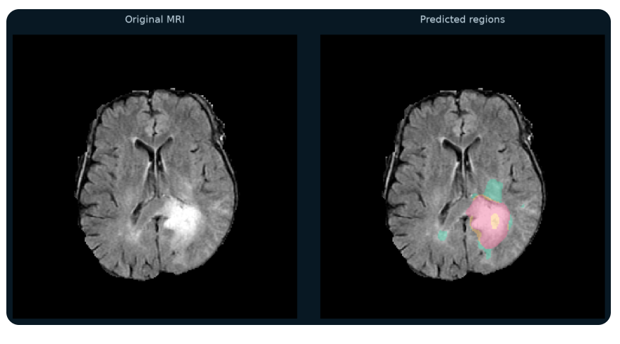
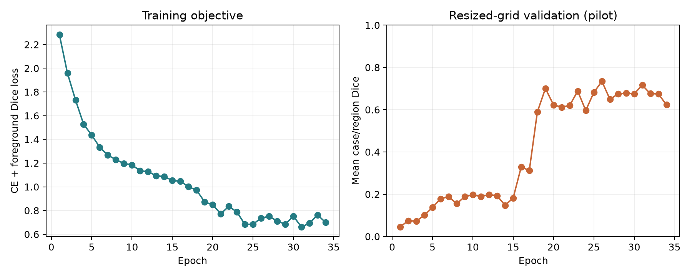

# NeuroSeg Research

**CPU-efficient brain tumor segmentation with a local MRI research dashboard.**

Built with Python, PyTorch, NiBabel and Streamlit. NeuroSeg segments prepared
multi-modal MRI volumes, reconstructs masks on the original image grid, measures
tumor-region volumes, and exports reproducible research reports.

Maintained by [Izhar Ullah (@izharullah733)](https://github.com/Izharullah733).

## Dashboard and example output

The local Streamlit dashboard provides model selection, MRI inspection and report export.



**Original MRI and predicted tumor regions:** green = edema, orange = non-enhancing
tumor, pink = enhancing tumor. This is an illustrative slice, not a reference mask
or a substitute for cohort-level evaluation.



The MRI visualization derives from MSD Task01 BrainTumour (BraTS-derived data).
See [screenshot attribution](docs/screenshots/README.md) for source and licensing.

## Pilot results

Mean Dice on **four validation cases**, using original-resolution predictions:

| Experiment | Whole tumor | Tumor core | Enhancing tumor |
|---|---:|---:|---:|
| Unweighted baseline | 0.720 | 0.000 | 0.000 |
| Class-balanced 2D U-Net | **0.849** | **0.763** | **0.637** |

The pilot uses 24 MSD BraTS-derived cases: 16 training, 4 validation, and 4
held-out test cases. **The test split has not been evaluated.** These are
exploratory, single-seed results with different training stopping points, not a
controlled causal comparison or evidence of clinical readiness. Small enhancing
regions remain a failure case. See the [full report](docs/EXPERIMENT_RESULTS.md).



Status: working data pipeline, compact 2D/2.5D models, training/resume,
original-grid evaluation, local Streamlit viewer and PDF/CSV/NIfTI export.
The viewer supports axial/coronal/sagittal inspection and validation-reference
comparison. The display is reordered to closest RAS; exported masks retain the
original MRI grid. Oblique volumes are not resliced into anatomical planes.
The official MSD BraTS-derived 24-case pilot has been downloaded. See
`docs/EXPERIMENT_RESULTS.md` when available for measured training results.
This is an early research project, not a clinical product or established novel method.

## Intended workflow

Validated BraTS NIfTI volumes -> patient-level split -> normalization and slice
sampling -> compact U-Net -> reconstructed volume -> region metrics and local report.

See the [roadmap](docs/ROADMAP.md), [dataset card](docs/DATASET_CARD.md), and
[methods and evaluation protocol](docs/METHODS.md).
The [model card](docs/MODEL_CARD.md) describes intended use and limitations.
Measured pilot results are in [EXPERIMENT_RESULTS.md](docs/EXPERIMENT_RESULTS.md).

## Install on Windows (Python 3.11)

```powershell
git clone https://github.com/Izharullah733/neuroseg-brain-tumor-segmentation.git
cd neuroseg-brain-tumor-segmentation
python -m venv .venv
.\.venv\Scripts\python.exe -m pip install --upgrade pip
.\.venv\Scripts\python.exe -m pip install torch==2.6.0 --index-url https://download.pytorch.org/whl/cpu
.\.venv\Scripts\python.exe -m pip install -r requirements.txt
```

**Raw MRI volumes, trained weights, patient reports and local databases are not included
in this repository.** Follow the reproduction steps below to download the pilot
from its official source and train a checkpoint before running inference.

## Launch the dashboard

```powershell
.\start_app.ps1
```

Open http://127.0.0.1:8501. All inference runs locally; telemetry is disabled.
The interface requires a trained checkpoint under `runs/*/best.pt`.

The recorded development run used an i5-7300U CPU and approximately 16 GB RAM,
without an NVIDIA GPU. That local environment reused existing CPU PyTorch through
`--system-site-packages`; the fresh setup above creates an independent environment.
Recorded package details are in `docs/environment.json` and
`docs/environment-local.txt`. A clean-machine installation has not yet been tested.

## Reproduce the pilot

Run from the project root in PowerShell:

```powershell
.\.venv\Scripts\python.exe scripts/download_data.py --patients 24
.\.venv\Scripts\python.exe scripts/prepare_data.py
.\.venv\Scripts\python.exe scripts/train.py --out runs/baseline --epochs 20 --steps-per-epoch 50
.\.venv\Scripts\python.exe scripts/evaluate.py --checkpoint runs/baseline/best.pt --split validation --out runs/baseline_validation
.\.venv\Scripts\python.exe -m pytest -q
```

For adjacent-slice context, use a separate output directory and `--context 3`.
Do not overwrite a completed experiment. Resume the last checkpoint with the
same configuration and `--resume runs/baseline/last.pt --epochs 16` to extend
training to a total of 16 epochs. New random runs need a fresh output directory.

An optional balanced-loss run can be launched with:

```powershell
.\run_pipeline.ps1 -RunName balanced_2d -Epochs 40 -ClassBalance sqrt_inverse -Patience 8
```

The recorded baseline early-stopped at epoch 15, selecting epoch 10. The balanced
run early-stopped at epoch 34, selecting epoch 26. Exact results can vary across
software and hardware environments. The 2.5D mode is implemented but has not yet
been evaluated in a controlled comparative study.

After training, run the real-MRI dashboard integration check:

```powershell
.\.venv\Scripts\python.exe scripts/check_app.py
```

This check creates a local analysis report. Unit tests use temporary synthetic
fixtures and do not require downloading the dataset.

The script stops at any failed stage and resumes a matching existing run. The
number of epochs is a total target; early stopping may finish sooner. Reusing a
run with different training settings is rejected to preserve reproducibility.

The downloader uses HTTP ranges against the documented AWS archive. It records
source, object ETag and file SHA256 hashes, and skips verified completed files
when rerun. Interrupted individual files are retried from their beginning.
Increasing cohort size requires a new processed directory to preserve prior
splits and checkpoint provenance. Approximately 224 MiB of compressed image data
and less than 1 GiB of slice cache are expected for this pilot; actual usage varies.

## Input contract

Either one four-channel NIfTI ordered FLAIR, T1w, T1 contrast-enhanced, T2w, or
four separately uploaded 3D NIfTIs with that assignment. Inputs must already
share a grid, be aligned/skull-stripped, and declare millimeter spatial units.
Raw clinical DICOM preprocessing is not implemented.

MSD labels are 0 background, 1 edema, 2 non-enhancing tumor, 3 enhancing tumor.
Other BraTS releases need an explicit adapter; do not silently reuse their IDs.

## Output and limitations

- Immutable-source manifests and deterministic case splits under `data/`.
- Versioned checkpoints, epoch logs and configs under `runs/<experiment>/`.
- Original-grid masks, JSON/PDF reports and volumes CSV per analysis.
- Local run index in `runs/history.sqlite`.
- Research pilot status is shown in the UI and reports. No diagnostic claims.

Small-cohort scores cannot establish generalization. Uncertainty calibration,
external validation, missing-modality robustness and a controlled multi-seed
study remain future milestones. Checkpoint selection uses resized validation
Dice; reported evaluation uses reconstructed original-grid masks.

## Repository guide

| Path | Purpose |
|---|---|
| `app.py`, `assets/` | MRI dashboard and local styling |
| `neuroseg/` | Data handling, model, training, inference, metrics and reporting |
| `scripts/` | Download, preparation, experiments, evaluation and integration checks |
| `tests/` | Geometry, labels, metrics, split isolation and deterministic resume tests |
| `docs/` | Architecture, dataset/model cards, methods, results and limitations |

Dataset source and attribution: [MSD on AWS](https://registry.opendata.aws/msd/),
with details in the [dataset card](docs/DATASET_CARD.md). Dataset materials have
their own CC-BY-SA 4.0 license. Full dataset files are not bundled here; the
illustrative output screenshot is attributed separately above.

## Initial smoke check

From this directory, run `python scripts/check_model.py` with PyTorch installed.
This checks only model tensor shapes and gradients using random inputs; it does
not measure segmentation quality or full training throughput.

Research prototype; outputs are not diagnostic recommendations.
