# System architecture

```mermaid
flowchart LR
    A[Official MSD archive] --> B[Range downloader and checksum manifest]
    B --> C[Read-only raw NIfTI volumes]
    C --> D[Geometry and label validation]
    D --> E[Fixed case splits and slice cache]
    E --> F[CPU training: 2D or 2.5D U-Net]
    F --> G[Versioned checkpoint and epoch logs]
    G --> H[Original-grid inference]
    C --> H
    H --> I[Region metrics and volume measurements]
    I --> J[PDF / JSON / CSV / NIfTI]
    J --> K[Local SQLite run index]
    G --> L[Streamlit local interface]
    L --> H
```

## Module responsibilities

| Module | Responsibility |
|---|---|
| `scripts/download_data.py` | Official-source indexing, selective download, checksums |
| `neuroseg/data.py` | Input contract, normalization, patient/case splits, slice cache |
| `neuroseg/model.py` | Compact U-Net logits |
| `neuroseg/training.py` | Losses, sampling, validation, reproducibility, resume |
| `neuroseg/inference.py` | Checkpoint validation, reconstruction, native-grid export |
| `neuroseg/metrics.py` | Region definitions, overlap/surface metrics, physical volume |
| `neuroseg/reporting.py` | Reports and local run history |
| `app.py` | Local viewer, input handling, experiment inspection and export |

## Data boundaries

- The downloader alone requires network access to retrieve data.
- Training and inference operate on local files; the viewer binds to loopback.
- Raw data are not overwritten. Processed cohorts have fixed manifests.
- Test cases are separated from validation and absent from demo selection.
- Weights-only checkpoint loading avoids general pickle execution.
- Reports identify both input and checkpoint by SHA256, and flag pilot status.
- Public publishing, cloud deployment and real clinical operation are outside
  the completed local pilot scope.
